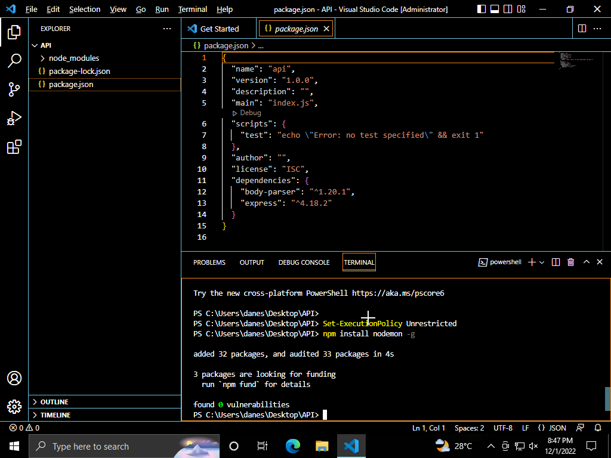

# restAPI-Demo
So you maybe have heard the term "restAPI" and "SOAP". If you're in the computing field, not knowing just highlights our languid attitude. 

This repo is a simple explanation and example of how restAPI works. It not really a high end or amazing thing. Heads up, there will be a massive lack of proper coding ethics because this is meant to just be an example of how restAPI's work. If you're expecting proper sanitization in code or whatever this is definitely not for you. But if you're here for just general knowledge, then get on board.

**What is a restAPI**
Its an application programming interface (API or web API) that conforms to the constraints of REST architectural style and allows for interaction with RESTful web services. 

**How restAPI's work**
REST APIs communicate via HTTP requests to perform standard database functions like creating, reading, updating, and deleting records (also known as CRUD) within a resource. For example, a REST API would use a GET request to retrieve a record, a POST request to create one, a PUT request to update a record, and a DELETE request to delete one. All HTTP methods can be used in API calls. A well-designed REST API is similar to a website running in a web browser with built-in HTTP functionality.

***Demonstration***

**Goal**

**Requirements**
1) [Windows Operating System](https://www.microsoft.com/software-download/windows11)
2) [Postman](https://www.postman.com/downloads/)
3) [Visual Studio Code](https://visualstudio.microsoft.com/downloads/)
4) [Node.js](https://nodejs.org/en/download/)

**Steps**
1) Create a folder in your desktop : 

2) Open Visual Studio Code as "**Run as Administrator**" :

3) Choose "**Open Folder**" and select the folder you created earlier :

4) Click on "**Terminal**" and select "**New Terminal**" :

5) Type in "**npm init**" :

"**npm init**" : "**node packet manager initialize**" which is used to set up a new or existing npm package.

6) Choose the default(press "**Enter**"), for all the questions :

7) A file name "**package.json**" should be created with similar content :

***IF YOU ENCOUNTER THIS ERROR, GIVEN YOU'RE RUNNING THIS ON A VIRTUAL MACHINE : ***

Make sure the clock in your VM is set properly to your real timezone.

8) Type in "**npm install express**" which will create a file called "**package-lock.json**" :

"**npm install express**" : "**node packet manager install express package**".

9) Type in "**Set-ExecutionPolicy Unrestricted**" and "**npm install nodemon**" :

"**Set-ExecutionPolicy Unrestricted**" : Beginning in PowerShell 6.0, this is the default execution policy for non-Windows computers and can't be changed.
"**npm install nodemon**" : Install "**Nodemon**" that helps develop node.js based applications by automatically restarting the node application when file changes in the directory are detected.

10) Finally create a file for the program. You can also just import the 23498092348329483249 file from this repo :

11) Now let's begin the process ((:
