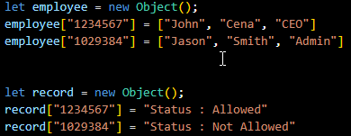

# restAPI-Demo
So you maybe have heard the term "restAPI" and "SOAP". If you're in the computing field, not knowing just highlights our languid attitude. 

This repo is a simple explanation and example of how restAPI works. It not really a high end or amazing thing. Heads up, there will be a massive lack of proper coding ethics because this is meant to just be an example of how restAPI's work. If you're expecting proper sanitization in code or whatever this is definitely not for you. But if you're here for just general knowledge, then get on board.

**What is a restAPI**
Its an application programming interface (API or web API) that conforms to the constraints of REST architectural style and allows for interaction with RESTful web services. 

**How restAPI's work**
REST APIs communicate via HTTP requests to perform standard database functions like creating, reading, updating, and deleting records (also known as CRUD) within a resource. For example, a REST API would use a GET request to retrieve a record, a POST request to create one, a PUT request to update a record, and a DELETE request to delete one. All HTTP methods can be used in API calls. A well-designed REST API is similar to a website running in a web browser with built-in HTTP functionality.

***Demonstration***

**Goal**
So the goal is simple. Just build a restAPI system for a given company that has a server room. Due to the high rate of hackers using social engineering for malice intentions, this system is meant to limit who can and cannot get into the server room. Each employee will have a NFC Card which will contain their First Name, Last Name and Employee Number. If employee does not have the needed position to enter the room, the system will say so. If an outsider tries to get in with a fake ID or something an error message will be raised and a security breach will be logged leading to security detaining the individual for further investigation. The IT Admin will be able to change the data in the databse according who is permitted to enter.

**Requirements**
1) [Windows Operating System](https://www.microsoft.com/software-download/windows11)
2) [Postman](https://www.postman.com/downloads/)
3) [Visual Studio Code](https://visualstudio.microsoft.com/downloads/)
4) [Node.js](https://nodejs.org/en/download/)

**Steps**
1) Create a folder in your desktop : 

2) Open Visual Studio Code as "**Run as Administrator**" :

3) Choose "**Open Folder**" and select the folder you created earlier :

4) Click on "**Terminal**" and select "**New Terminal**" :

5) Type in "**npm init**" :

"**npm init**" : "**node packet manager initialize**" which is used to set up a new or existing npm package.

6) Choose the default(press "**Enter**"), for all the questions :

7) A file name "**package.json**" should be created with similar content :

***IF YOU ENCOUNTER THIS ERROR, GIVEN YOU'RE RUNNING THIS ON A VIRTUAL MACHINE :***

Make sure the clock in your VM is set properly to your real timezone.

8) Type in "**npm install express**" which will create a file called "**package-lock.json**" :

"**npm install express**" : "**node packet manager install express package**".

9) Type in "**Set-ExecutionPolicy Unrestricted**" and "**npm install nodemon**" :

"**Set-ExecutionPolicy Unrestricted**" : Beginning in PowerShell 6.0, this is the default execution policy for non-Windows computers and can't be changed.
"**npm install nodemon**" : Install "**Nodemon**" that helps develop node.js based applications by automatically restarting the node application when file changes in the directory are detected.

10) Finally create a file for the program. You can also just import the 23498092348329483249 file from this repo :

11) Now let's begin the process ((:

Demo 

1) So this gonna be our database from where we get the information we need. You can change or update it according to your preference. 

Usually a backend database must be used but like I said earlier this just for knowledge purposes. Using a proper database is gonna massively complicate stuff.

I) The top portion of the code is the header. The header is what always carries the Authentication Data.

II) The below portion is body. It usally contains miscellaneous data.

(FYI, you have to manually enter the details into Postman.)

2) Now for the GET request : 

Here is where the admin/security personnel will be able to determine whether the individual is an imposter or actual employee. 

The header and body contain the needed deatils so an alert wont be raised.

Given the individual is an employee but doesnt have the needed security clearence, this will be the output : 

Given the person is a someone who's not meant to be there the output will seem like this :

Invalid First Name

Invalid Last Name

Invalid Employee Number

This will the raise an alert which will lead to the individual not being able to execute their intentions. 

As we can see in the code and pictures, numerals(AKA status codes) of "200, 401, 404, 501" each carry a given meaning. You can learn more about it [here](https://en.wikipedia.org/wiki/List_of_HTTP_status_codes).
